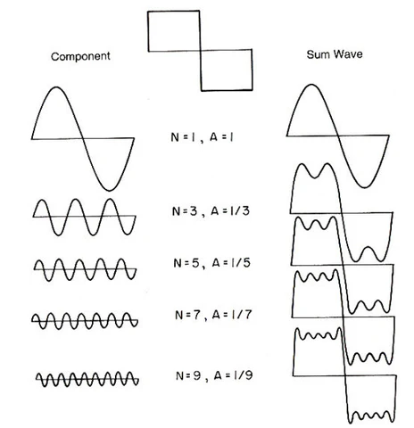
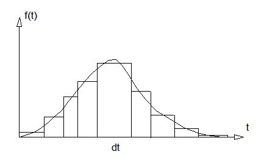

# Muzika na struju

## Uvod

Ovaj workshop spaja fiziku, matematiku i programiranje kroz jedan konkretan cilj: **napraviti zvuk od nule, pa ga oblikovati**.

Proći ćemo kroz sve slojeve — od toga šta je zvuk kao fizički talas, kako ga računar reprezentuje i pušta kroz zvučnike, kako se matematički modeliraju filteri i efekti, i na kraju kako se sve to implementira u kodu i spaja sa pravom klavijaturom.

---

## Šta ćemo naučiti

- Šta je zvuk i kako se opisuje matematički
- Kako računar generiše i pušta zvuk (sample rate, bafer, zvučna kartica)
- Kako se zvuk analizira i vizualizuje
- Kako rade RLC filteri i zašto su važni za audio
- Kako se analogni filter pretvara u digitalni algoritam
- Kako se zvuk "iskrivljuje" i oblikuje efektima

---
---

# Deo 1 – Fizika zvuka

## Zvuk = talas

Zvuk je pritisak vazduha koji se periodično menja — molekuli se guraju i razilaze, i taj poremećaj se prostire kroz prostor.

Kod prostog harmonijskog oscilatora ubrzanje je proporcionalno pomeraju i usmereno ka ravnotežnom položaju.

$$ \alpha = -w^2 y $$$
$$
\alpha = \frac{d^2y}{dt^2}
$$

Matematički, jedan čist ton je rešenje ove diferencijalne jednačine:

```
y(t) = A · sin(2π · f · t)
```

- **A** := amplituda (glasnoća)
- **f** := frekvencija (visina tona, Hz)
- **t** := vreme

Promena amplitude menja glasnoću, ali ne i visinu tona. Dva tona se sabiraju direktno - superpozicija.


---

## Boja zvuka - zašto violina nije klavir

Dva instrumenta mogu svirati isti ton iste glasnoće, a potpuno drugačije zvučati. Razlog je **boja zvuka (timbar)** — raspodela harmonika u signalu.

Svaki realni zvuk nije čist sinus. To je zbir sinusa na frekvencijama `f`, `2f`, `3f`, `4f`... (osnovni ton + harmonici). Kako su ti harmonici raspoređeni po amplitudi — to određuje karakter zvuka.

**Primer - zvuk klavira:**
https://www.youtube.com/watch?v=ogFAHvYatWs&t=254s

Vizualizacija harmonika u realnom vremenu moguća je u **WaveForms virtualnom osciloskopu**.

---

## Furijeov red - svaki signal je zbir sinusa

Furijeova teorema kaže da se bilo koji periodični signal može razložiti na beskonačnu sumu sinusa različitih frekvencija i amplituda. Ovo je temelj analize zvuka — **FFT (Fast Fourier Transform)** to radi u realnom vremenu.

Posebno ilustrativan primer: **kvadratni talas**. Matematički sadrži beskonačno harmonika (3f, 5f, 7f, ...), i upravo zato zvuči "prljavo" i bogato, ne čisto.

```
  +1  ──────┐      ┌──────┐      ┌──────
            │      │      │      │
  -1        └──────┘      └──────┘
```



---
---

# Deo 2 – Fizička realizacija zvuka u računaru

## Diskretizacija — od talasa do brojeva

Računar ne može raditi sa neprekidnim talasom — seče ga na **uzorke (samples)** u regularnim vremenskim intervalima.

- **Sample rate** = broj uzoraka u sekundi
- CD standard: **44100 Hz** → 44100 uzoraka po sekundi
- Svaki uzorak = trenutna vrednost amplitude, tipično `float32` u opsegu `[-1.0, 1.0]`



Membrana zvučnika vibrira tačno onoliko puta u sekundi koliko mu govorimo — mi joj šaljemo niz brojeva, ona ih pretvara u fizički pokret.

---

## Oscilator i bafer

**Oscilator** je matematička funkcija koja generiše uzorke:

```go
phase += 2 * math.Pi * frequency / sampleRate
sample := math.Sin(phase)
```

**Bafer** je mali paket uzoraka koji šaljemo zvučnoj kartici odjednom. Zvučna kartica ih čita i pretvara u napon za zvučnik.

Tok podataka:

```
Oscilator → Bafer → Zvučna kartica → Zvučnik → Uho
```

---

## Go + OTO biblioteka

Koristimo Go i `oto` biblioteku za direktan pristup zvučnoj kartici.

**Ključni koncepti:**

- **Kontekst** := glavni objekat koji pravi konekciju sa drajverom
- **Plejer** := jedan izvor zvuka unutar konteksta
- **`Read(p []byte)`** := naš oscilator; `io.Reader` je "ugovor" koji kaže: "svako ko hoće biti izvor zvuka mora implementirati ovu metodu"

```go
type Oscillator struct {
    frequency  float64
    sampleRate float64
    phase      float64
}

func (o *Oscillator) Read(p []byte) (n int, err error) {
    // Generišemo uzorke, konvertujemo float32 → bajtovi
    for i := 0; i+3 < len(p); i += 4 {
        o.phase += 2 * math.Pi * o.frequency / o.sampleRate
        sample := float32(math.Sin(o.phase))

        bits := math.Float32bits(float32(v))
	binary.LittleEndian.PutUint32(p[i*4:], bits)
    }
    return len(p), nil
}
```

**Tipovi — zašto tri različita:**
- `float64` —> matematika voli preciznost
- `float32` —> standard za audio (manji memorijski otisak, dovoljna preciznost)
- `[]byte` —> hardver očekuje sirove bajtove

Hardver diktira tempo —> zvučna kartica poziva `Read()` kada joj treba više podataka.

---

## Miksovanje i clipping

Više uzoraka se sabira direktno. Problem nastaje kada zbir pređe `[-1.0, 1.0]` - to je **clipping**, iskrivljavanje zbog prekoračenja opsega.

Rešenje - normalizacija:

```go
mixed := (sample1 + sample2) * 0.5
```

---

---

## Akordi 

Akord je samo više sinusa u isto vreme. Odnosi frekvencija su precizni razlomci:

| Akord | Intervali | Karakter |
|-------|-----------|---------|
| Dur | 1.0 · 1.25 · 1.5 | Svetao |
| Mol | 1.0 · 1.20 · 1.5 | Taman |
| Power chord | 1.0 · 1.5 | Sirov |
| Diminished | 1.0 · 1.20 · 1.414 | Napetost |
| Sus4 | 1.0 · 1.333 · 1.5 | Nedovršen, čeka razrešenje |

Sus4 uho doživljava kao pitanje bez odgovora.

---
---

# Deo 3 – Filteri: od fizike do koda

## Šta je audio filter

Osnovna audio signal je **signal koji se menja u vremenu**. Filter određuje koje frekvencije propušta, a koje blokira.

**Impedansa (Z)** - "otpor" koji komponenta pruža naizmeničnoj struji; zavisi od frekvencije.

---

## Tri pasivne komponente

### Otpornik – R – "kočničar"

- `R = const`, ne zavisi od frekvencije
- Podjednako gasi sve frekvencije
- Partner kondenzatoru i kalemu
- Određuje oštrinu filtera i postavlja granicu jačine signala

---

### Kondenzator – C

Dve provodne ploče razdvojene izolatorom. Kapacitivna reaktansa:

$$X_C = \frac{1}{2\pi f C}$$

- Niske f → ogroman Xc → kondenzator **blokira**
- Visoke f → mali Xc → kondenzator kratko spaja → **propušta**

**Zašto?** Viša frekvencija znači da se signal brže menja → kondenzator se brže puni i prazni i ne stignie da pruži otpor signalu.

---

### Kalem – L

Namotan žica oko koje se stvara magnetno polje kad protiče struja. Induktivna reaktansa:

$$X_L = 2\pi f L$$

- Niske f → mali XL → kalem propušta
- Visoke f → ogroman XL → kalem **blokira**

**Zašto?** Brzi signal naglo menja smer/jačinu struje → kalem indukuje suprotnu struju koja se protivi toj promeni *(Lencov zakon)*.

---

Rezonantna frekvencija LC kola:

$$\boxed{f_0 = \frac{1}{2\pi\sqrt{LC}}}$$

---

## Tipovi filtera

### Low-pass — uklanjanje visokih frekvencija

- Kalem **redno** (blokira visoke)
- Kondenzator **paralelno** (kratko spaja visoke ka uzemljenju)

### High-pass — uklanjanje niskih frekvencija

- Kondenzator **redno** (blokira niske)
- Kalem **paralelno** (kratko spaja niske ka uzemljenju)

### Band-pass — propušta samo opseg oko f₀

Kombinacija low-pass i high-pass: uklanja i preniske i previsoke frekvencije, propušta samo opseg oko rezonantne frekvencije.

**Primer iz prakse:** FM radio prijemnik na 100 MHz.
1. Antena hvata gomilu frekvencija
2. RLC kolo podešeno na 100 MHz rezonuje baš na toj frekvenciji
3. Sve ostale frekvencije se potiskuju

> **Analogija — guranje ljuljaške:**
> Presporo ili prebrzo → malo zamaha. Tačno u ritmu ljuljaške → ogroman zamah.
> RLC kolo isto tako rezonuje na f₀.

---

## Od analognog filtera do digitalnog algoritma

### RLC diferencijalna jednačina

Analogno RLC kolo opisuje se diferencijalnom jednačinom:

$$L\frac{d^2i}{dt^2} + R\frac{di}{dt} + \frac{1}{C}i = x(t)$$

*Klasični oscilator sa prigušenjem.*

### Diskretizacija — izvodi postaju razlike

Prelazimo sa neprekidnog vremena `t` na diskretno `n`:

```
t = n·T,   gde je T = 1 / sample_rate
```

Izvodi postaju razlike:

$$\frac{dy}{dt} \approx \frac{y[n] - y[n-1]}{T} \qquad \frac{d^2y}{dt^2} \approx \frac{y[n] - 2y[n-1] + y[n-2]}{T^2}$$

Posle ubacivanja i sređivanja dobijamo **rekurzivnu formulu**:

$$y[n] = Ax[n] + By[n-1] + Cy[n-2]$$

- **A** := koliko direktno ulaz utiče
- **B** := koliko sistem "pamti trenutno stanje" (oscilatornost)
- **C** := koliko pamti "inerciju kretanja" (stabilnost)

### Digitalni filter — samo računanje

```
Analogni filter → elektronika rešava jednačinu
Digitalni filter → CPU rešava jednačinu
```

Nema kalemova, nema kondenzatora — samo tri koeficijenta i tri množenja po uzorku.

---

## Biquad filter — opšti oblik

Svaki ozbiljan audio EQ, low-pass, high-pass ili band-pass filter je **biquad**:

$$\boxed{y[n] = a_0 x[n] + a_1 x[n-1] + a_2 x[n-2] + b_1 y[n-1] + b_2 y[n-2]}$$

### Primer: Low-pass na 440 Hz, sample rate 44100 Hz

$$y[n] = 0{,}059 \cdot x[n] + 0{,}941 \cdot y[n-1]$$

### Primer: High-pass na 440 Hz, sample rate 44100 Hz

$$y[n] = 0{,}941 \cdot (x[n] - x[n-1]) + y[n-1]$$

---

## Izvođenje koeficijenata — RLC → biquad (primer za band-pass)

Za f₀ = 440 Hz:

$$\sqrt{LC} = \frac{1}{2\pi f_0} = 3{,}619 \cdot 10^{-4} \implies LC = 13{,}097 \cdot 10^{-8}$$

Uzmimo `L = 10⁻² H` → `C = 13,1 · 10⁻⁶ F`, `R = 10 Ω`.

Polazna jednačina (uzimamo napon na R kao izlaz):

$$LC \cdot y'' + RC \cdot y' + y = RC \cdot x'$$

Posle diskretizacije sa T = 1/44100:

$$\left(\frac{LC}{T^2} + \frac{RC}{T} + 1\right)y[n] = \frac{RC}{T}\bigl(x[n] - x[n-1]\bigr) + \left(\frac{2LC}{T^2} + \frac{RC}{T}\right)y[n-1] - \frac{LC}{T^2}\,y[n-2]$$

**Finalna forma (band-pass filter oko 440 Hz):**

$$\boxed{y[n] = 0{,}02206\,(x[n] - x[n-1]) + 1{,}9691 \cdot y[n-1] - 0{,}9725 \cdot y[n-2]}$$

---
---

# Deo 4 – MIDI: jezik između muzičara i mašine

## Šta je MIDI

**MIDI (Musical Instrument Digital Interface)** nije zvuk — to je protokol poruka.

Kada pritisneš tipku na klavijaturi, ona ne šalje audio signal. Šalje kratku binarnu poruku:

```
Nota 69, pritisak 80, ON
```

Računar (ili vaš synth) prima tu poruku i odlučuje kako da je pretvori u zvuk. Isti MIDI signal može da pokrene grand klavir, električni bas ili robotski zvuk - sve zavisi od toga ko ga prima i interpretira.

Ovo je ključna razlika: **MIDI opisuje šta se svira, ne kako zvuči.**

---

## Anatomija MIDI poruke

Svaka MIDI nota nosi tri informacije:

| Polje | Vrednost | Opis |
|-------|----------|------|
| Status | `0x90` | "Note On" na kanalu 1 |
| Nota | 0 – 127 | Koji ton (broj) |
| Velocity | 0 – 127 | Koliko jako je pritisnuta tipka |

Postoji 128 MIDI nota, numerisanih od 0 do 127. Srednja C (C4) je nota broj **60**.

```
Nota  0  → najdublji ton (C-1, ispod opsega čujnosti)
Nota 60  → srednje C (C4)
Nota 69  → A4 = kamertonski 440 Hz
Nota 127 → najviši ton (G9)
```

Razmak između dva susedna broja je uvek jedan **polustepen** (poluton, semitone).

---


## Kratka istorija skale —> zašto 12 tonova?
 
Pre nego što dođemo do formule, vredi razumeti odakle uopšte dolazi sistem od 12 polustepena.
 
### Pitagorejska ugađanja - čisti odnosi
 
Stari Grci su primetili da određeni odnosi frekvencija zvuče "harmonično":
 
| Interval | Odnos frekvencija | Primer |
|----------|-------------------|--------|
| Oktava | 2 : 1 | 440 Hz → 880 Hz |
| Kvinta | 3 : 2 | 440 Hz → 660 Hz |
| Kvarta | 4 : 3 | 440 Hz → 587 Hz |
 
Pitagora je pokušao da izgradi celu skalu koristeći samo čiste kvinte (odnos 3:2). Kreneš od C, ideš 12 kvinti gore, i trebalo bi da se vratiš na isto C, samo 7 oktava više.
 
Problem: ne vratiš se tačno.
 
```
12 čistih kvinti: (3/2)^12 = 129,746...
7 oktava:          2^7     = 128,000...
```
 
Razlika se zove **Pitagorejska koma** - mali ali čujni nesklad koji uništava harmoniju kada pokušaš da svirаš u više tonaliteta na istom instrumentu.
 
### Ravnomerno temperovanje - matematički kompromis
 
Rešenje koje danas koristimo svuda, **ravnomerno temperovano ugađanje** (*equal temperament*), formalizovano je krajem 18. veka. Ideja je elegantna: podeli oktavu na 12 **matematički jednakih** delova.
 
Jedini čisti interval koji ostaje je oktava (2:1). Sve ostalo je blago iskrivljeno u odnosu na čiste odnose, ali ravnomerno i čujno prihvatljivo.
 
| Interval | Čisti odnos | Equal temperament | Razlika |
|----------|-------------|-------------------|---------|
| Kvinta | 1,5000 | 1,4983 | ≈ −2 centa |
| Velika terca | 1,2500 | 1,2599 | ≈ +14 centa |
| Mala terca | 1,2000 | 1,1892 | ≈ −16 centa |
 
*Cent je jedna stotinka polustepena — minimalna merljiva razlika visine tona za prosečno uho.*
 
Cena kompromisa: nijedan interval osim oktave nije savršeno čist. Prednost: možeš svirati u svakom tonalitetu na istom klaviru, bez potrebe za ponovnim ugađanjem.
 
Upravo ovaj sistem je kodiran u MIDI-ju i u formuli koja sledi.
 
---
 
## Od MIDI broja do frekvencije
 
Ovo je formula koja pretvara MIDI broj u frekvenciju:
 
$$\boxed{f(n) = 440 \cdot 2^{\frac{n - 69}{12}}}$$
 
**Zašto ovako?**
 
Polazimo od note 69 = A4 = **440 Hz**. To je međunarodni standard, po toj frekvenciji se štimuju orkestri.
 
Svaka oktava gore **duplira** frekvenciju:
- A4 = 440 Hz
- A5 = 880 Hz
- A3 = 220 Hz
U jednoj oktavi ima tačno **12 polustepena**. Svaki sledeći poluton množi frekvenciju sa istim faktorom `r`, i posle 12 koraka mora biti duplo:
 
$$r^{12} = 2 \implies r = 2^{\frac{1}{12}} \approx 1{,}05946$$
 
Ako od note 69 idemo `(n − 69)` koraka, frekvencija se menja eksponencijalno:
 
$$f(n) = 440 \cdot \left(2^{\frac{1}{12}}\right)^{n-69} = 440 \cdot 2^{\frac{n-69}{12}}$$
 
---
 
## Nekoliko primera
 
| MIDI nota | Naziv | Frekvencija |
|-----------|-------|-------------|
| 57 | A3 | 220,00 Hz |
| 60 | C4 (srednje C) | 261,63 Hz |
| 64 | E4 | 329,63 Hz |
| 67 | G4 | 392,00 Hz |
| 69 | A4 | 440,00 Hz |
| 72 | C5 | 523,25 Hz |
| 81 | A5 | 880,00 Hz |
 
---
 
## Implementacija u Go
 
Umesto da računamo formulu svaki put, gradimo tabelu unapred — 128 množenja jednom pri startu, a onda samo lookup po indeksu tokom sviranja:
 
```go
var midiFreqTable [128]float64
 
func BuildMidiFreqTable() {
    for i := 0; i < 128; i++ {
        midiFreqTable[i] = 440.0 * math.Pow(2.0, float64(i-69)/12.0)
    }
}
```
 
`math.Pow` je skupa operacija. U audio petlji koja se poziva 44100 puta u sekundi, svako kašnjenje se oseća. Tabela to rešava: računaš jednom, koristiš uvek.
 
---
 
## Primanje MIDI poruka —> gomidi biblioteka
 
Koristimo `gitlab.com/gomidi/midi/v2` sa `rtmididrv` drajverom:
 
```go
package main
 
import (
    "fmt"
    "math"
    "time"
 
    "gitlab.com/gomidi/midi/v2"
    _ "gitlab.com/gomidi/midi/v2/drivers/rtmididrv"
)
 
var midiFreqTable [128]float64
 
func BuildMidiFreqTable() {
    for i := 0; i < 128; i++ {
        midiFreqTable[i] = 440.0 * math.Pow(2.0, float64(i-69)/12.0)
    }
}
 
func main() {
    defer midi.CloseDriver()
 
    BuildMidiFreqTable()
 
    inPorts := midi.GetInPorts()
    if len(inPorts) == 0 {
        fmt.Println("Nije pronađena nijedna klavijatura!")
        return
    }
 
    in := inPorts[0]
    fmt.Println("Pritisni dirke na klavijaturi")
 
    _, err := midi.ListenTo(in, func(msg midi.Message, timestampms int32) {
        var channel, note, velocity uint8
        ts := int64(uint32(timestampms))
 
        if msg.GetNoteOn(&channel, &note, &velocity) {
            if velocity == 0 {
                // velocity 0 na Note On = Note Off — čest slučaj u MIDI protokolu
                fmt.Printf("[Note OFF] Nota: %d | Freq: %.2f Hz | Vreme: %d ms\n",
                    note, midiFreqTable[note], ts)
            } else {
                fmt.Printf("[Note ON]  Nota: %d | Freq: %.2f Hz | Velocity: %d | Vreme: %d ms\n",
                    note, midiFreqTable[note], velocity, ts)
            }
        }
    })
 
    if err != nil {
        fmt.Printf("Greška pri slušanju: %v\n", err)
        return
    }
 
    for {
        time.Sleep(time.Second)
    }
}
```
 
Nekoliko detalja vrednih pažnje:
 
`_ "gitlab.com/gomidi/midi/v2/drivers/rtmididrv"` — blank import registruje drajver kao side-effect, bez eksplicitnog poziva. Go pattern koji se često sreće sa drajverima i pluginovima.
 
`velocity == 0` na Note On poruci je legitimni Note Off —> deo MIDI specifikacije iz 1983. Štedi jedan bajt statusa slanjem iste Note On komande sa nultim velocityjem.
 
`int64(uint32(timestampms))` — timestamp dolazi kao `int32` koji može biti negativan zbog overflow-a, pa eksplicitna konverzija kroz `uint32` ispravlja wraparound.


---

## MIDI kanal i velocity

**Kanal** (1–16) omogućava da jedan MIDI kabl nosi 16 nezavisnih instrumenata odjednom. Primer: kanal 1 = klavir, kanal 10 = bubnjevi (10 je rezervisan za perkusije po MIDI standardu).

**Velocity** (0–127) nije samo glasnoća — realni sintetizatori ga koriste i za boju zvuka. Tiho udarena nota na pravom klaviru zvuči mekše, ne samo tiše.

Osnovna upotreba:

```go
func velocityToAmplitude(velocity int) float64 {
    return float64(velocity) / 127.0
}
```

Sofisticiranija varijanta: kvadratna kriva daje prirodniji osećaj dinamike.

```go
func velocityToAmplitude(velocity int) float64 {
    v := float64(velocity) / 127.0
    return v * v  // kvadratna kriva, prirodniji osećaj
}
```


---
---

# Deo 5 – Audio efekti: matematika manipulacije signalom

## Distorzija i kvadratni talas

Najbrži način da uništiš čistotu sinusnog talasa — ograniči amplitudu silom (hard clipping):

```go
if signal > 0.8 { signal = 0.8 }
if signal < -0.8 { signal = -0.8 }
```

Talas koji sada ima odrečene "bregove", a ekstremni slučaj je kvadratni talas. Furije kaže da kvadratni talas matematički sadrži beskonačno harmonika (3f, 5f, 7f...). Uho čuje sve to odjednom i percipira "prljav" i bogat zvuk koje zovemo distorzijom.

Smanjivanjem limita dobijamo agresivniji zvuk, na 0.01 skoro potpun kvadratni talas.

---

## Vibrato

Frekvencija tona se polako ljulja gore-dole pod uticajem sporog oscilatora (LFO):

```
f(t) = 440 + sin(2π · 6 · t) × 10
```

`6 Hz` je brzina ljuljanja, `10` je dubina u hercima.

| LFO frekvencija | Efekat |
|-----------------|--------|
| 1–3 Hz | Opersko, sporo vibrato |
| 5–8 Hz | Klasično - gitara, violina |
| 20–50 Hz | Tremolo, nestabilno |
| 80+ Hz | FM sinteza - potpuno novi timbar |

Taj poslednji slučaj je posebno zanimljiv: isti kod, samo brži broj, i dobijaš zvuk koji nema veze sa originalnim tonom. FM sinteza je osnova DX7 synthesizera iz 80ih.

### FM sinteza
signla = sin(Nosilac + sin(Modulator))
- stvara se beskonačno mnogo bočnih frekvencija

---

## Ring Modulation

Menja se jačina zvuka (amplituda)
signal = Nosilac × Modulator
Množenje dva sinusa razbija oba originalna tona i na izlazu daju samo zbir i razliku:

```
output(t) = sin(2π · f_carrier · t) × sin(2π · f_modulator · t)

carrier   = 300 Hz
modulator =  50 Hz
Čuješ:     350 Hz  i  250 Hz  ← nastaju
Ne čuješ:  300 Hz  i   50 Hz  ← nestaju
```

Originalni tonovi nestaju. Zvuči robotski i hladno - ne pripada nijednom prirodnom instrumentu.


---

## ADSR — životni ciklus zvuka

Svaki realni instrument ima karakteristično "ponašanje glasnoće" kroz vreme:

```
Glasnoća
  │
  │    ╭─╮
  │   ╱   ╲_________
  │  ╱               ╲
  │ ╱                  ╲────
  │╱                        ╲
  └──────────────────────────────  Vreme
      A    D      S         R
```

- **Attack** — koliko brzo se glasnoća diže od nule
- **Decay** — pad do normalnog nivoa posle inicijalnog udarca
- **Sustain** — nivo dok je dirka pritisnuta
- **Release** — koliko polako zvuk nestaje posle otpuštanja

Isti ton sa attack od 5ms vs 500ms zvuči kao potpuno drugačiji instrument.

---

## Delay i Echo

```
output(t) = signal(t) + 0.6 × signal(t − Δt) + 0.36 × signal(t − 2Δt) + ...
```

- Ispod 30ms — ne čuješ kao eho, već kao promenu prostora
- Iznad 100ms — prepoznatljivi eho
- Sinhronizovano sa tempom — ritmički element (Pink Floyd gitarska tehnika)

---

## Bitcrusher — namerna degradacija

CD je 16-bit (65536 nivoa amplitude). Spuštanjem na 4-bit (16 nivoa):

```
0.73847281 × 16 = 11.8 → round → 12 → 12/16 = 0.75
```

Glatka kriva postaje stepenasta. To je lo-fi stil.

---

## Reverb

Akustika prostorije simulirana u kodu —> hiljade kratkih delay-eva sa nasumičnim kašnjenjima:

$$\text{reverb}(t) = \sum_i \text{signal}(t - \tau_i) \times a_i$$

| Tip | Decay time | Karakter |
|-----|-----------|---------|
| Room | 0.3–0.8s | Mala prostorija |
| Hall | 1–3s | Koncertna dvorana |
| Cathedral | 3–8s | Ogromno, atmosferično |
| Spring | 0.5–2s | Gitarsko pojačalo, vintage |
| Plate | 0.5–2s | Studio klasik |

---

## Signal chain —> redosled efekata

Redosled menja sve:

```
Instrument → EQ → Distorzija → Chorus → Delay → Reverb → Izlaz
```

Distorzija pre reverba: distorzuješ čist signal.
Reverb pre distorzije: distorzuješ i reverb zajedno —> muljavo, haotično, ponekad odlično.


---
---

*Srećno sa sintisajzovanjem : )*

*P.S. Ako vam se ovo sviđa, bacite pogled na programski jezik ChucK, jezik dizajniran isključivo za programiranje muzike u realnom vremenu* :*