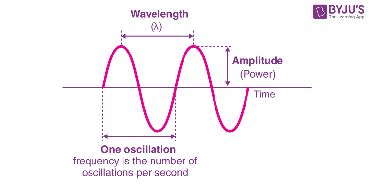

# Muzika u Golangu

## Uvod

---

## Saznaćemo:

- Šta je zvuk
- Kako se proizvodi zvuk u računaru
- Analiza zvuka
- Matematika, računarstvo, slike i muzika?

---

## Fizika zvuka

- Zvuk = talas
- Amplituda, frekvencija, talasna duzina
- Jedan ton iako se aplituda menja
- Sabiranje

 

## Boja zvuka
- Ista amplituda i frekvencija a drugačiji zvuk
- Harmonici
- Moduliranje talasa
- Veštački zvuk (sintisajzer)
- Vizualizacija u virtualnom oscilloscopu - WaveForms

##  Zvuk klavira?
https://www.youtube.com/watch?v=ogFAHvYatWs&t=254s

----

# Fizička realizacija

- Sample rate, diskretizacija
- Membrana zvučnika vibrira f puta u sekundi
- Oscilator - matematička funkcija koja se ponavlja - krug koji se vrti i generiše vrednosti
- Bafer - mali paket u kom šaljemo brojeve zvučnoj kartici
- Zvučna kartica ih pretvara u U za zvučnike
- Tvoje uho to registruje kao ton
---
## GO
### OTO biblioteka
- Kontekst - glavni objekat - pravi konekciju sa drajverima za zvučnike
- Jedan kontekst i više plejera
- Funkcija Read() je naš oscilator
- io.Reader = 'ugovor' - svako ko hoće da bude izvor podataka mora ga ima implementiranu metodu Read(p []byte)
- Zvučna kartica očekuje niz bajtova
- Hardver diktira tempo

### Tipovi
- Matematika voli float64
- Standard za zvuk je float32
- Hardver voli nizove bajtova

### Gramofon
- frekvencija - koji zvuk
- sample rate - koliko kvalitetan
- sample - igla
- read - mehanizam koji okrece plocu
- Read mora tacno da zna koji gramofon je, gde je stao itd.

----

## Kucanjeeeeeeee

- Teorija miksinga - sprečavanje clippinga